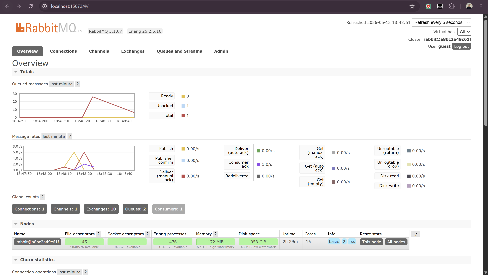
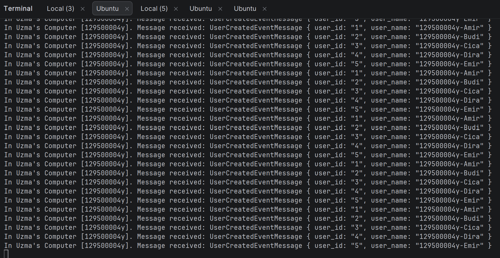

# REFLEKSI MODUL 9
## What is amqp?
AMQP (Advanced Message Queuing Protocol) adalah protokol standar terbuka untuk pengiriman pesan antar aplikasi atau
middleware. Protokol ini memungkinkan pengirim (publisher) dan penerima (subscriber) berkomunikasi melalui perantara
yang disebut message broker (dalam hal ini RabbitMQ), meskipun aplikasi-aplikasi tersebut dibangun dengan teknologi atau
bahasa pemrograman yang berbeda. AMQP mengatur bagaimana pesan dikirim, diarahkan melalui antrean (queue), dan
dipastikan sampai ke tujuannya dengan aman.

## What does it mean? guest:guest@localhost:5672 , what is the first guest, and what is the second guest, and what is localhost:5672 is for?
guest:guest@localhost:5672 merupakan URL koneksi yang digunakan aplikasi untuk terhubung ke RabbitMQ. Komponen-komponen
dari string tersebut terdiri dari guest pertama yang merupakan Username default untuk mengakses RabbitMQ, guest kedua
yang merupakan Password default yang digunakan bersama dengan username tersebut, localhost:5672 yang menunjukkan alamat
Host atau lokasi di mana server RabbitMQ berjalan dengan nomor Port 5672 yang digunakan oleh RabbitMQ untuk mendengarkan
komunikasi data melalui protokol AMQP.

Berdasarkan foto di atas, jumlah pesan dalam queued messages mengalami peningkatan yang signifikan hingga mencapai 
sekitar 25 pesan. Hal ini terjadi karena adanya ketidakseimbangan antara kecepatan produksi pesan oleh publisher dan
kecepatan pemrosesan oleh subscriber.  Dalam simulasi ini, subscriber dibuat menjadi lambat dengan menambahkan instruksi
thread::sleep(ten_millis) yang memberikan jeda paksa selama 1 detik untuk setiap pemrosesan pesan . Di sisi lain,
publisher dijalankan beberapa kali secara cepat, di mana setiap eksekusi mengirimkan 5 buah event ke message broker.
Karena publisher terus mengirimkan permintaan baru sementara subscriber masih sibuk memproses pesan sebelumnya,
pesan-pesan yang belum terproses tersebut ditampung sementara di dalam antrean RabbitMQ . Pesan-pesan ini akan berkurang
secara bertahap satu per satu seiring dengan selesainya pemrosesan yang dilakukan oleh subscriber yang lambat tersebut.  

Berdasarkan hasil simulasi dengan menjalankan setidaknya tiga subscriber secara bersamaan, terlihat bahwa beban
pemrosesan pesan dari publisher tidak lagi menumpuk pada satu terminal saja. Dalam arsitektur berbasis event ini,
RabbitMQ bertindak sebagai penyeimbang beban (load balancer) yang mendistribusikan pesan dari antrean kepada setiap
subscriber yang tersedia. Hal ini menyebabkan lonjakan antrean pesan pada dashboard RabbitMQ berkurang jauh lebih cepat
dibandingkan saat hanya menggunakan satu subscriber. Setiap subscriber memproses pesan secara bergantian, sehingga 
meskipun masing-masing subscriber memiliki hambatan waktu pemrosesan, sistem secara keseluruhan tetap responsif karena
tugas-tugas tersebut dikerjakan secara paralel oleh banyak pekerja.
